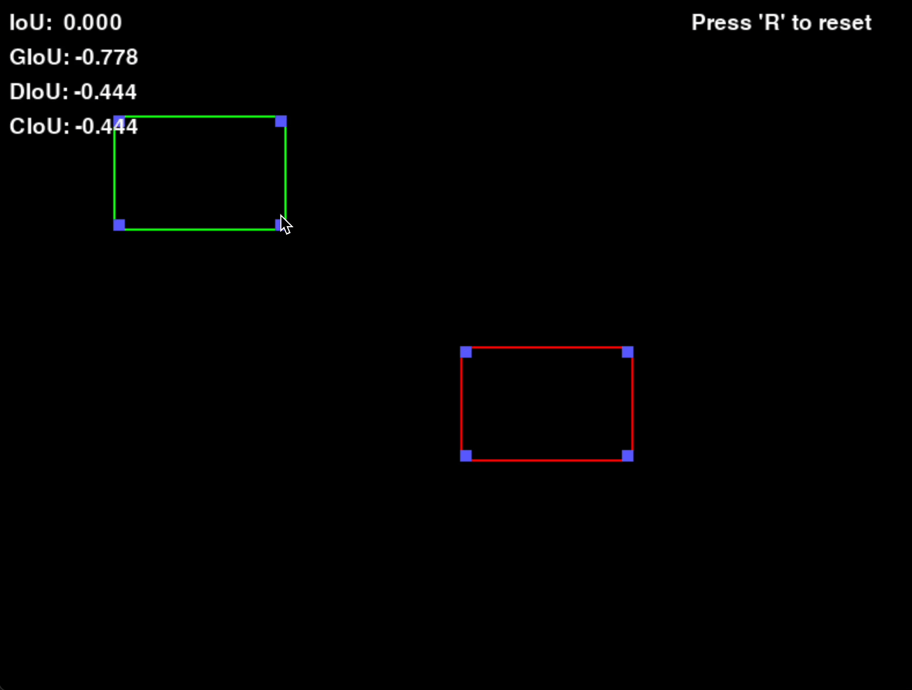

# 🟩 BBox Arena – Interactive IoU Metrics Game (Pygame + CV)

BBox Arena is a fun, interactive game built using **Pygame** where you can move and resize two bounding boxes like browser windows and observe real-time IoU-based metrics:

📊 **IoU**, **GIoU**, **DIoU**, **CIoU**

## 🎮 Features

- 🔁 **Move** Box 1 (Arrow Keys) and Box 2 (WASD)
- 🖱️ **Drag boxes** and **resize from corners** (like Chrome/VSCode windows)
- 🔍 Real-time display of:
  - IoU
  - GIoU
  - DIoU
  - CIoU
- 🔄 **Reset** to initial position/sizes by pressing `R`

---

## 🧠 Why this project?

This game is perfect for:
- Learning how bounding box metrics behave interactively
- Teaching CV students how IoU variants differ
- Integrating computer vision knowledge into game design
- Fun demo for DL/CV project portfolios

---

## 🎮 Demo Screenshot




### 🔧 Prerequisites

Install Pygame:
```bash
pip install pygame
